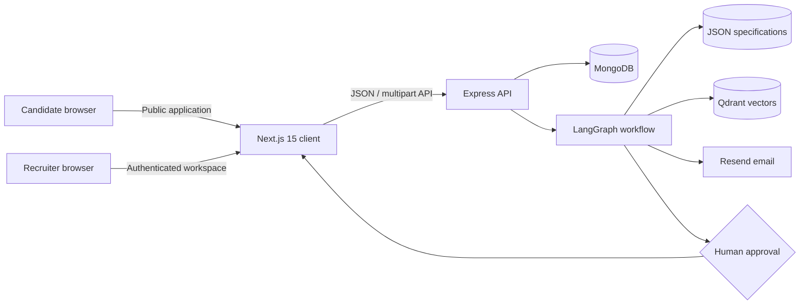

# AgenticHire AI

AgenticHire AI is a spec-driven recruitment operations platform. Recruiters publish roles, candidates apply through public career pages, and a persisted LangGraph workflow parses resumes, stores searchable context, evaluates fit, pauses for human approval, and completes interview/email actions.

The project is an applicant-tracking and workflow-orchestration system—not a chatbot. Hiring thresholds, scoring weights, workflow steps, retry behavior, prompts, RAG parameters, and email copy are runtime specifications under [`specs/`](specs/).

## Why this project exists

Recruitment automation is useful only when it is visible and controllable. AgenticHire combines autonomous processing with an explicit human checkpoint and a recruiter-facing execution graph. Every candidate decision remains traceable to a hiring spec and workflow log.

## Product capabilities

- Recruiter signup, login, JWT authentication, and tenant-isolated data
- Job creation backed by hiring and workflow specifications
- Public, crawlable careers directory and per-job application pages
- PDF validation, upload, and structured resume extraction
- LangGraph agent execution with retry rules and persisted state
- Qdrant resume storage and context retrieval
- Deterministic, spec-weighted candidate matching and shortlisting
- Human approval/rejection checkpoint before downstream actions
- Interview question, task, and rubric generation
- Resend email delivery with a safe development simulation mode
- React Flow workflow graph with node status, retries, and failures
- Candidate, completion-rate, shortlist-rate, and agent analytics
- Sitemap, robots rules, and JobPosting structured data

## Architecture at a glance



See [Architecture](docs/architecture.md) for component, execution, and deployment diagrams.

## Technology

| Layer | Technology |
|---|---|
| Frontend | Next.js 15 App Router, React 19, JavaScript, Tailwind CSS, Zustand |
| Forms | React Hook Form-ready validation patterns and Zod contracts |
| Visualization | React Flow (`@xyflow/react`) |
| API | Node.js 20+, Express, Zod, Helmet, rate limiting |
| Persistence | MongoDB with Mongoose |
| Workflow | LangGraph |
| Retrieval | Qdrant with deterministic local development embeddings |
| Email | Resend |
| Tests | Jest, Supertest, Testing Library |
| Operations | Docker, Docker Compose, GitHub Actions |

## Repository map

```text
Agentichire-AI/
├── client/                 Next.js application
├── server/                 Express API, agents, workflows, models, tests
├── specs/                  Runtime business and orchestration rules
├── docs/                   Architecture, APIs, schema, operations, decisions
├── .github/                CI/CD workflows and issue templates
├── docker-compose.yml      Local MongoDB and Qdrant
├── spec.md                 Product implementation specification
└── package.json            Root development commands
```

## Quick start

### Prerequisites

- Node.js 20 or newer
- Docker Desktop with Docker Compose
- Git

### 1. Configure the applications

PowerShell:

```powershell
Copy-Item server\.env.example server\.env
Copy-Item client\.env.local.example client\.env.local
node -e "console.log(require('crypto').randomBytes(48).toString('base64url'))"
```

Paste the generated value into `JWT_SECRET` in `server/.env`. Never commit `.env` files.

### 2. Start infrastructure

```powershell
docker compose up -d
docker compose ps
```

MongoDB listens on `27017`; Qdrant listens on `6333`.

### 3. Install and run

```powershell
npm.cmd install
npm.cmd run install:all
npm.cmd run dev
```

- Web application: `http://localhost:3000`
- Public careers page: `http://localhost:3000/jobs`
- API: `http://localhost:5000`
- Health check: `http://localhost:5000/health`

## Verify the end-to-end flow

1. Open `/signup` and create a recruiter account.
2. Create a job at `/dashboard/jobs/create`.
3. Open the job’s public page or `/jobs` careers directory.
4. Submit a text-based PDF resume through `/jobs/{jobId}/apply`.
5. Open `/dashboard/workflows` and inspect the persisted graph.
6. Approve or reject the human checkpoint.
7. Confirm downstream workflow state and analytics.

When `RESEND_API_KEY` is blank, email is simulated and still logged as a successful development action.

## Configuration

### Server

| Variable | Required | Purpose |
|---|---:|---|
| `NODE_ENV` | No | `development`, `test`, or `production` |
| `PORT` | No | Express port; defaults to `5000` |
| `CLIENT_URL` | Yes in production | Allowed frontend origin(s), comma-separated |
| `MONGODB_URI` | Yes | MongoDB/Atlas connection string |
| `JWT_SECRET` | Yes | Private JWT signing secret |
| `QDRANT_URL` | Yes | Local or Qdrant Cloud endpoint |
| `QDRANT_API_KEY` | Cloud only | Qdrant database API key |
| `RESEND_API_KEY` | Email only | Resend API key |
| `EMAIL_FROM` | Email only | Verified sender address |
| `UPLOAD_DIR` | No | Resume directory or persistent disk mount |

### Client

| Variable | Required | Purpose |
|---|---:|---|
| `NEXT_PUBLIC_API_URL` | Yes | Public Express API URL |
| `NEXT_PUBLIC_APP_URL` | Production | Canonical frontend URL for sitemap and job metadata |

## Tests and quality gates

```powershell
npm.cmd test
npm.cmd run build
```

Individual commands:

```powershell
npm.cmd test --prefix server
npm.cmd test --prefix client
npm.cmd run build --prefix client
```

CI repeats tests, the optimized frontend build, dependency audits, and Docker image builds. See [Testing](docs/testing.md).

## API documentation

- [API usage guide](docs/api.md)
- [OpenAPI 3.1 contract](docs/openapi.yaml)
- [API design principles](docs/api-design.md)

All responses use one envelope:

```json
{ "success": true, "data": {} }
```

or:

```json
{ "success": false, "error": { "code": "VALIDATION_ERROR", "message": "..." } }
```

## Technical documentation

- [Architecture](docs/architecture.md)
- [Database schema](docs/database-schema.md)
- [Design decisions](docs/design-decisions.md)
- [Security model](docs/security.md)
- [Deployment runbook](docs/deployment.md)
- [Known limitations](docs/limitations.md)
- [Engineering roadmap](docs/roadmap.md)
- [Contributing](CONTRIBUTING.md)

## Deployment

The recommended hosted topology is Vercel (`client/`), Render (`server/`), MongoDB Atlas, Qdrant Cloud, and Resend. Follow the [deployment runbook](docs/deployment.md). Local filesystem uploads must use a persistent disk or be replaced with private object storage before processing real applicant data.

## Project status

This repository is a production-shaped MVP: the main recruitment journey, isolation boundaries, tests, documentation, container builds, and CI/CD templates are implemented. Remaining scale and compliance work is documented openly in [Known limitations](docs/limitations.md).

## Responsible use

AI scores support recruiters; they do not replace accountable human decisions. Before collecting real applicant information, publish an appropriate privacy notice, define retention/deletion procedures, verify email/domain ownership, and review the system for the laws and employment policies that apply to your organization and candidates.
