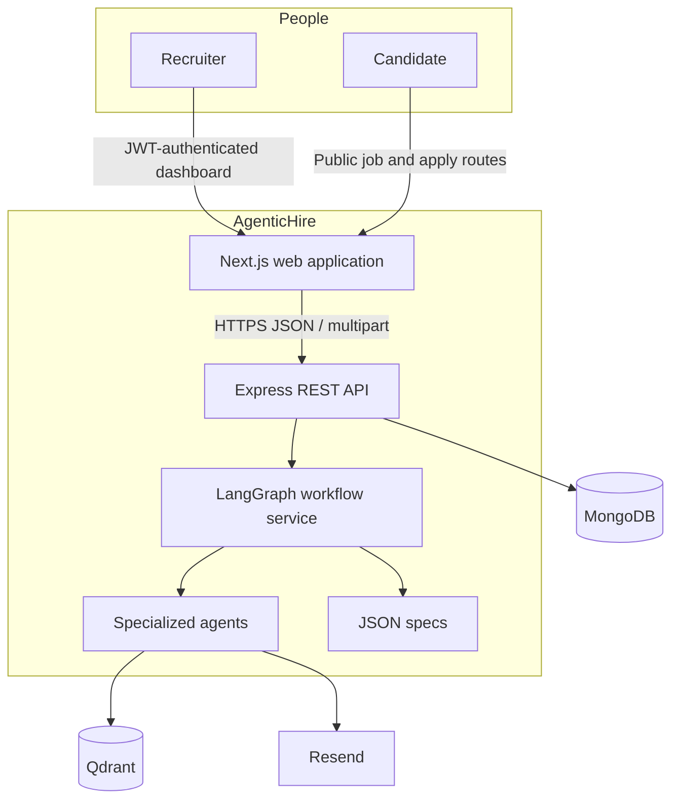
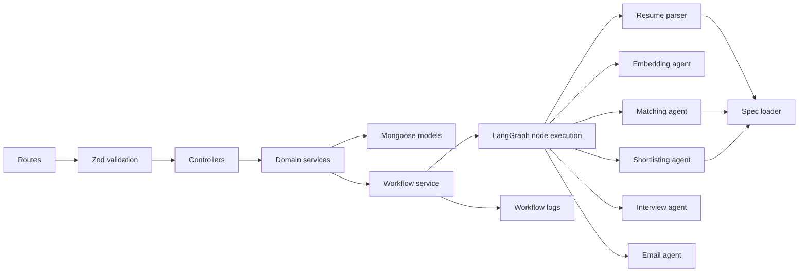
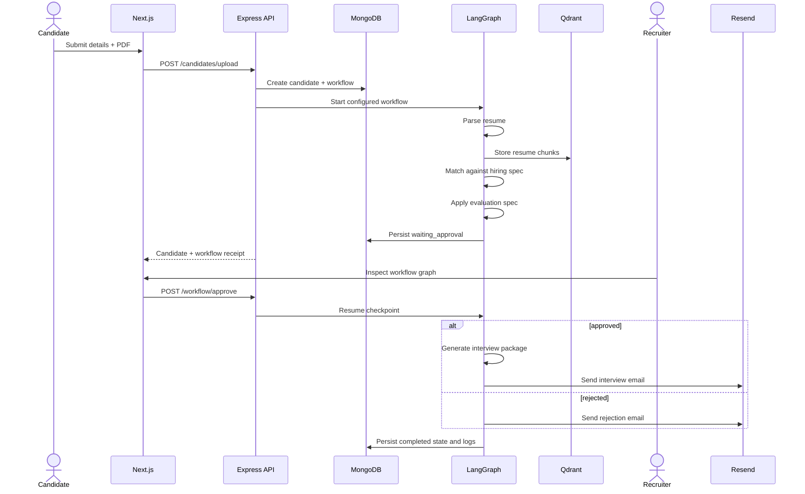
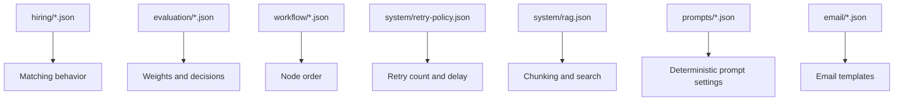
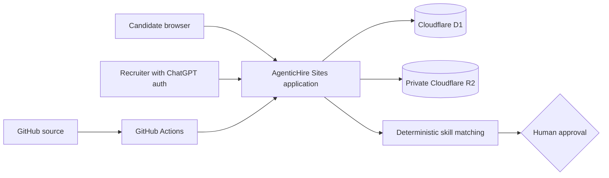
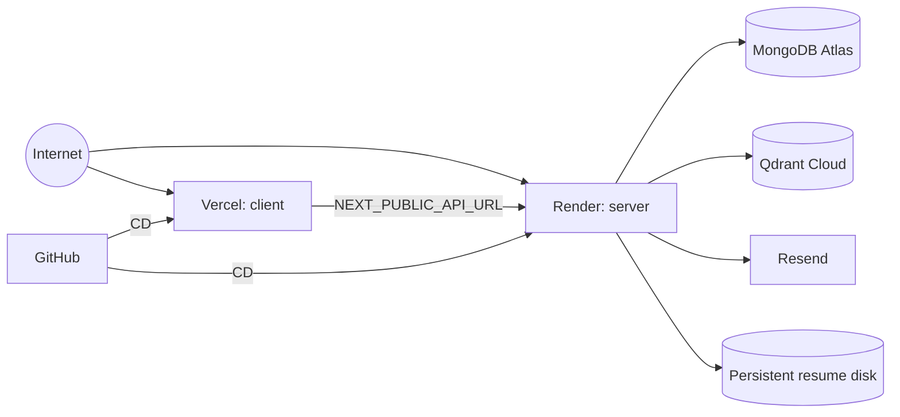

# Architecture

## Architectural goals

AgenticHire is designed around five constraints:

1. Business decisions come from versioned JSON specifications.
2. Candidate processing is asynchronous in shape, persisted, retryable, and observable.
3. Public candidate routes and recruiter-only operations have separate trust boundaries.
4. Every automated recommendation pauses for an accountable human decision.
5. External services are replaceable behind small service/agent modules.

## System context

## Backend component model

The Express application is a modular monolith. A single deployable API owns request validation, authorization, workflow persistence, and agent execution. Modules are separated by responsibility so high-volume steps can later move to workers without redesigning the HTTP contract.

## Candidate workflow

## State and persistence

MongoDB is the source of truth for users, jobs, candidates, workflows, and execution logs. Workflow state is written before and after each agent node. The saved context contains only JSON-serializable results required to resume later; Mongoose documents and file handles are not persisted inside graph context.

Qdrant is a derived retrieval store. Resume chunks can be regenerated from the original uploaded file while that file remains available. A Qdrant outage is classified by the retry spec and recorded in workflow logs.

## Specification boundary

Adding a role or changing a threshold should change a spec, not a controller. Specs are cached per process; a production spec-management feature would add validation, versioning, and cache invalidation.

## Security boundaries

- Candidate job discovery and application submission are public.
- Recruiter jobs, candidate records, workflows, approvals, logs, and analytics require a signed JWT.
- Recruiter queries are scoped through the `createdBy` relationship on jobs.
- Passwords are hashed with bcrypt and never returned by default.
- Inputs are Zod-validated, Mongo operators are sanitized, uploads are PDF-only and size-limited, and HTTP headers/rates are hardened.
- Browser origins are allowlisted using `CLIENT_URL`.
- Secrets are environment variables and ignored by Git.

See [Security](security.md) for the threat model and operational requirements.

## Deployment topology

### Live managed topology

The managed edition in `production-site/` is the active hosted application. It combines public careers pages and recruiter routes in one deployable unit. D1 stores jobs, candidates, and workflow logs; R2 stores PDF resumes privately; recruiter access uses ChatGPT authentication. Tenant-scoped queries and the human approval checkpoint remain enforced in application code.

### Reference service topology

The client and server deploy independently from the same repository. Production resume handling needs a private persistent disk or object store. The deployment runbook records every environment mapping and smoke test.

## Scaling path

The first scaling boundary is workflow execution. Upload requests currently run agent nodes until the approval checkpoint. At higher volume, the controller should enqueue a workflow ID and return `202 Accepted`; one or more workers should then execute nodes with idempotency keys and distributed locking. MongoDB remains the state store, and the API contract does not need to change materially.
