# Database schema

MongoDB is the authoritative application database. Mongoose supplies schema validation, references, timestamps, and indexes. API responses expose MongoDB `_id` values as resource identifiers.

## Entity relationships

```mermaid
erDiagram
    USER ||--o{ JOB : creates
    JOB ||--o{ CANDIDATE : receives
    JOB ||--o{ WORKFLOW : configures
    CANDIDATE ||--|| WORKFLOW : processed_by
    WORKFLOW ||--o{ WORKFLOW_LOG : records

    USER {
        ObjectId _id PK
        string name
        string email UK
        string password
        string role
        datetime createdAt
        datetime updatedAt
    }
    JOB {
        ObjectId _id PK
        ObjectId createdBy FK
        string title
        string companyName
        string location
        string employmentType
        string description
        array requiredSkills
        array preferredSkills
        number minExperience
        string hiringSpecId
        string workflowSpecId
        boolean isActive
        datetime createdAt
        datetime updatedAt
    }
    CANDIDATE {
        ObjectId _id PK
        ObjectId jobId FK
        string name
        string email
        string phone
        string resumeUrl
        object parsedResumeJson
        number matchScore
        string status
        datetime createdAt
        datetime updatedAt
    }
    WORKFLOW {
        ObjectId _id PK
        ObjectId candidateId FK
        ObjectId jobId FK
        array steps
        string currentState
        string status
        object context
        datetime createdAt
        datetime updatedAt
    }
    WORKFLOW_LOG {
        ObjectId _id PK
        ObjectId workflowId FK
        string agentName
        object input
        object output
        string status
        string error
        string stack
        datetime createdAt
        datetime updatedAt
    }
```



## Collections

### `users`

The recruiter identity boundary. `email` is unique, lowercased, and indexed. `password` contains only a bcrypt hash and is excluded from normal query selection.

### `jobs`

Recruiter-owned job definitions. `hiringSpecId` and `workflowSpecId` refer to validated files under `specs/`. `companyName`, `location`, and `employmentType` support public job metadata. Public routes return active jobs; authenticated management routes filter by `createdBy`.

### `candidates`

Candidate identity, upload reference, parsed resume, score, and lifecycle status. `jobId` is indexed because most recruiter views and authorization checks are job-scoped.

Candidate status values:

```text
submitted → processing → waiting_approval → approved/rejected → completed
                         ↘ shortlisted/hold
processing/waiting_approval → failed
```

### `workflows`

Durable execution state. `steps` stores each configured node’s status, retries, timestamps, and error. `context` stores only resume/match/shortlist/interview results needed for resumption. `candidateId` is indexed.

Workflow status values are `running`, `waiting_approval`, `completed`, and `failed`.

### `workflowlogs`

Append-only execution evidence associated with a workflow. Each entry captures agent name, sanitized input identity, JSON output, status, error, stack, and timestamps. Access is authorized through the workflow’s recruiter-owned job.

## Index and integrity notes

- `users.email`: unique index
- `candidates.jobId`: lookup index
- `workflows.candidateId`: lookup index
- `workflowlogs.workflowId`: ordered log lookup index
- Mongoose references are application-enforced; MongoDB does not provide foreign-key cascades.
- Deleting a job is intentionally not exposed in the MVP because candidate/workflow retention behavior must be defined first.

## Data lifecycle

The MVP does not yet automate retention. Before real applicant use, define organization-specific retention periods and implement a deletion service that removes candidate documents, workflow/log records, resume files, and Qdrant points together. See [Known limitations](limitations.md).
