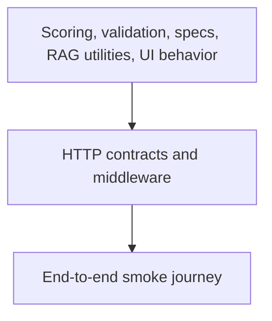

# Testing strategy

## Quality pyramid



## Server tests

Server Jest/Supertest coverage verifies:

- structured health and not-found responses
- CORS rejection
- invalid upload behavior
- request schemas and unsafe spec-path rejection
- spec loading and traversal protection
- spec-driven scoring and configurable decisions
- deterministic embedding and chunking utilities

Run:

```powershell
npm.cmd test --prefix server
```

## Client tests

Testing Library verifies visible component behavior and the public application submission state. Next/Jest supplies App Router-compatible transformation and jsdom.

```powershell
npm.cmd test --prefix client
```

## Build verification

The production build is a separate gate because it catches server/client component boundaries, dynamic route issues, metadata errors, and environment-dependent rendering failures.

```powershell
npm.cmd run build --prefix client
```

## Manual end-to-end test

With MongoDB and Qdrant running:

1. Sign up and log in.
2. Create a role with company, location, skills, and spec IDs.
3. Confirm it appears at `/jobs` and exposes JobPosting JSON-LD.
4. Apply with a text-based PDF.
5. Confirm parsing, vector storage, score, and waiting approval.
6. Approve and confirm interview/email nodes complete.
7. Repeat with rejection and confirm interview is skipped.
8. Temporarily stop Qdrant and verify configured retries/logs.
9. Log in as a second recruiter and confirm the first recruiter’s data is absent.

## CI gates

Pull requests and main-branch pushes run clean installs, server/client tests, the client production build, production dependency audits, and both Docker image builds. Deployment runs only after CI succeeds on `main` and only when deployment secrets are configured.

## Future test work

- MongoDB-memory-backed authorization/controller integration suite
- Playwright browser journey against disposable MongoDB/Qdrant services
- provider contract tests for Qdrant and Resend
- workflow concurrency/idempotency tests
- resume parser corpus covering scanned, malformed, and multi-column PDFs
